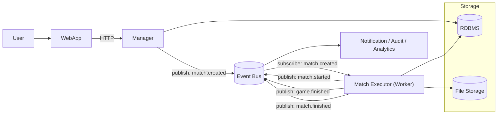

# System Overview

`docs/product/SPECS.md` is normative. This doc maps the current implementation shape and extension directions.

---

## Layer map

```
┌────────┐
│  User  │
└────┬───┘
     │
     ▼
┌──────────────┐
│     Web      │
└──────┬───────┘
       │
       ▼
┌──────────────┐
│   Service    │
└───┬─────┬────┘
    │     │
    │     ▼
    │ ┌──────────────┐
    │ │  MatchExec   │
    │ │ Queue/Runner │
    │ └──────┬───────┘
    │        │
    ▼        ▼
┌──────────────────┐
│      Store       │
│ SQLite + Files   │
└──────────────────┘
```

```
Web (BFF)
  │
  ▼
Service
  ├─ Read/Write data ─────► Store
  └─ Enqueue match jobs ──► MatchExec (via injected Queue interface)
                               ├─ Persist events ──► Events ──► Store
                               └─ Persist results ──────────────► Store
```

**Import rules (enforced):**
```
web
 └── service

service
 ├── store
 └── submission

submission
 ├── artifact
 └── store

matchexec
 ├── artifact
 ├── events
 ├── sandbox
 ├── service  (types/constants only; service does not import matchexec)
 ├── runner
 └── store

sandbox
 └── artifact

events
 └── store

artifact
 └── (no internal dependencies)

store
 └── (no internal dependencies)
```

---

## Package reference

| Package | Role |
|---|---|
| `cmd/progames` | Entry point: wires all packages and manages process lifecycle |
| `internal/auth` | Session-based authentication and identity |
| `internal/config` | Environment-loaded configuration |
| `internal/events` | Append-only match event log; execution log projection; source of truth for replay |
| `internal/matchexec` | Match execution: game loop orchestration and async job queue |
| `internal/obs` | Operational metrics and counters |
| `internal/runner` | Bot process lifecycle: start, move I/O, timeout, teardown; built-in system agent |
| `internal/service` | Domain services, domain types, and store converters |
| `internal/artifact` | Storage-agnostic file repository (`Repository`, `PathResolver`) and local filesystem implementation |
| `internal/sandbox` | Docker isolation: compilation (`Compiler`) and runner image building (`BuildRunnerImage`) |
| `internal/store` | Persistence: SQL queries |
| `internal/submission` | Code validation, build orchestration, and agent creation |
| `internal/testhelper` | Shared test helpers: `NewDockerClient`, `NewStore`, `NewArtifactRepo`, `TestConfig` |
| `internal/web` | HTTP server, page handlers, BFF translation, and template rendering |
| `pkg/engine/caro` | Caro game rules: board, move validation, win detection — pure library, no I/O |

---

## Target architecture (future scale-out)



Extension points from current implementation:

- `matchexec.Queue` → replace with an event bus consumer subscribing to `match.created`; `Processor` stays the same
- Match Executor publishes lifecycle events (`match.started`, `game.finished`, `match.finished`) back to the bus — Notification, Audit, and Analytics subscribe without touching the execution path
- `artifact.Repository` → swap `LocalRepository` for any remote backend (S3, Azure Blob, NFS) without touching `submission` or `matchexec`
- `web.Frontend` → add API handlers alongside, reusing the same service layer

---

## Extension guides

### Tournaments

1. Add tournament service in `internal/service/`.
2. Add bracket and entry persistence in `internal/store/`.
3. Add tournament page handlers and DTOs in `internal/web/`.
4. Bracket matches reuse the existing match execution queue; no changes to the execution path.

### Second game type

1. Implement a game engine in `pkg/engine/<type>/` matching the board/move/result contract.
2. Extract a game factory interface in `matchexec` and inject it at construction time; `Processor` currently calls the caro engine directly.
3. Game player encoding in `store` is already game-agnostic.

### Multiple concurrent workers

`matchexec.Queue` runs a single worker goroutine consuming a bounded channel. Fan out to a pool by starting multiple workers against the same channel. `Processor` is stateless between calls; no interface changes needed.

### JSON API

The HTTP server already separates page and API routing. Add API handlers alongside the existing page handlers, reusing the same service layer; BFF translation stays web-only.

### Artifact storage

`internal/artifact` provides `Repository` and `PathResolver` interfaces backed by `LocalRepository`. To swap in remote storage, implement `Repository` against the target backend (S3, Azure Blob, etc.) and wire it in `main.go`; `submission` and `matchexec` require no changes. Note: `PathResolver` (used by `matchexec` to locate binaries for execution) is only implementable with a local cache layer — remote backends must download to a local path before returning it.
