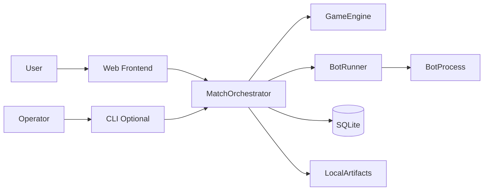
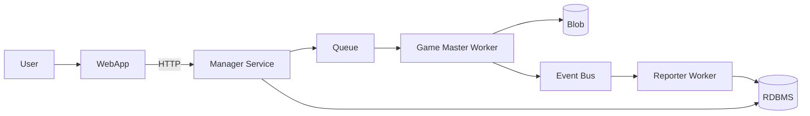

# System Overview

`docs/product/SPECS.md` is normative. This doc only maps implementation shape.

## Architecture views

1. **Foundation (current)**: single logical system for practice flow.
2. **Target (future)**: distributed scale-out for high concurrency.

## Foundation architecture (high level)

- Practice is the first ship target (`SPECS.md` §16).
- Match rules, statuses, bot protocol, limits, logs/replay follow `SPECS.md` §14.
- CLI is optional in foundation; web flow exists for users (`SPECS.md` §16.1, §16.3).

## Target architecture (future)

Future direction keeps current domain contracts, then adds:

- queue + worker execution,
- artifact/blob storage,
- event-driven reporting.
