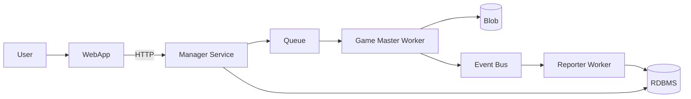

# System Overview

## Purpose

Progames is a distributed platform for running code-based agents in turn-based matches.
This document describes the high-level service architecture and data flow.

## High-level architecture (from diagram)

## Component responsibilities

### User
- Initiates actions such as submitting code and running matches.

### WebApp
- Primary user interface.
- Sends HTTP requests to Manager Service.

### Manager Service
- Receives HTTP requests from WebApp.
- Validates and prepares match jobs.
- Persists metadata/state to RDBMS.
- Enqueues jobs to Queue.

### Queue
- Buffers and distributes match jobs to workers.
- Decouples request ingestion from fight execution.

### Game Master (Worker)
- Consumes jobs from Queue.
- Runs sandboxed agents.
- Executes match orchestration.
- Collects match result and match logs.
- Uploads match artifacts to Blob.
- Emits compact match lifecycle signals to Event Bus.

### Event Bus
- Carries lightweight match lifecycle signals.
- Avoids large payload transfer by referencing existing artifacts.

### Reporter (Worker)
- Subscribes to events from Event Bus.
- Updates match metadata/state in RDBMS.
- Does not store artifacts in Blob.

### RDBMS
- System of record for metadata and queryable structured data.
- Typical data: submissions, matches, status, summaries, references.

### Blob
- Object storage for large artifacts.
- Typical data: raw match logs, replay payloads, downloadable outputs.

## End-to-end flow

1. User interacts with WebApp.
2. WebApp sends HTTP request to Manager Service.
3. Manager validates and prepares the match request.
4. Manager persists request metadata in RDBMS.
5. Manager publishes a match job to Queue.
6. Game Master worker consumes the job and executes the match with sandboxed agents.
7. Game Master uploads result/log artifacts to Blob.
8. Game Master emits a compact match signal to Event Bus.
9. Reporter worker consumes events.
10. Reporter updates structured match metadata in RDBMS.

## Non-goals (P0)

- Detailed code/module mapping
- Low-level class/package design
- UI/UX architecture
- Multi-game plugin architecture details

## Next architecture docs

- Context and container diagrams (C4 style)
- Event contracts for Event Bus
- Data model for RDBMS and artifact model for Blob
- Operational topology and scaling strategy
